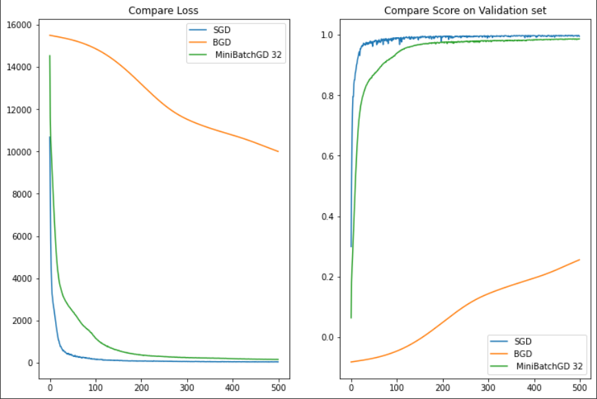
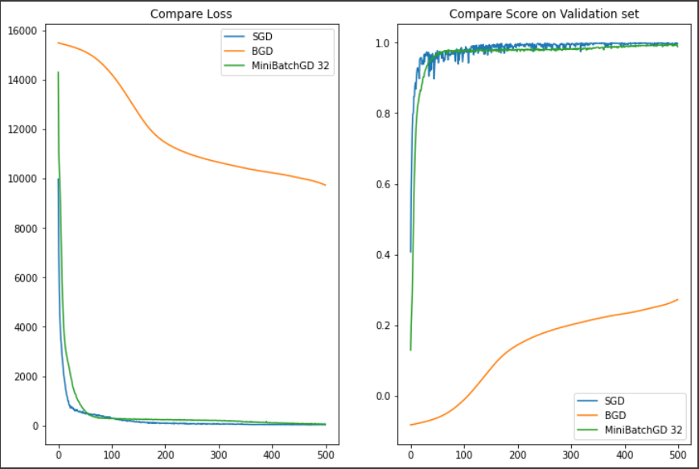
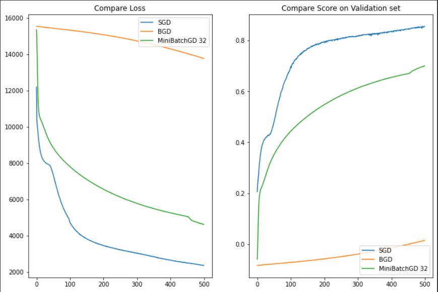
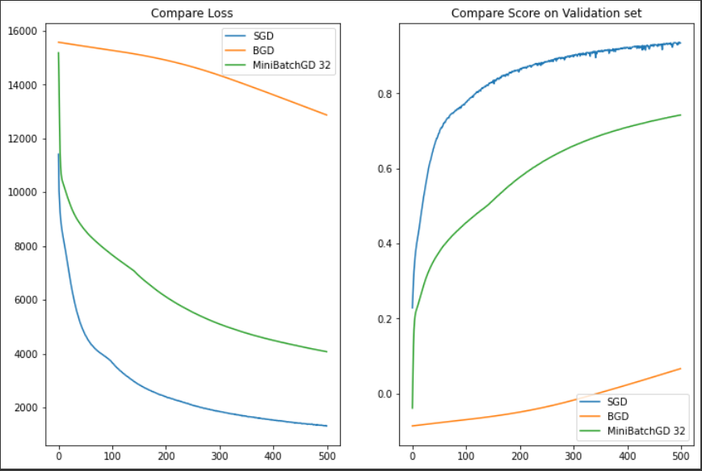
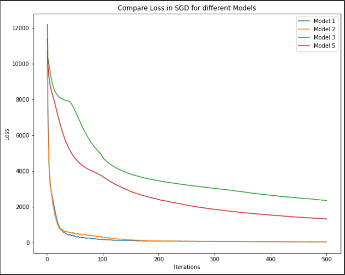
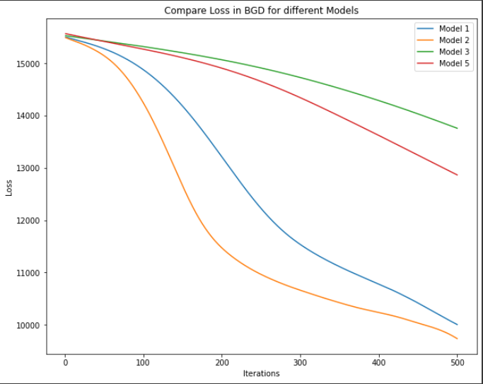
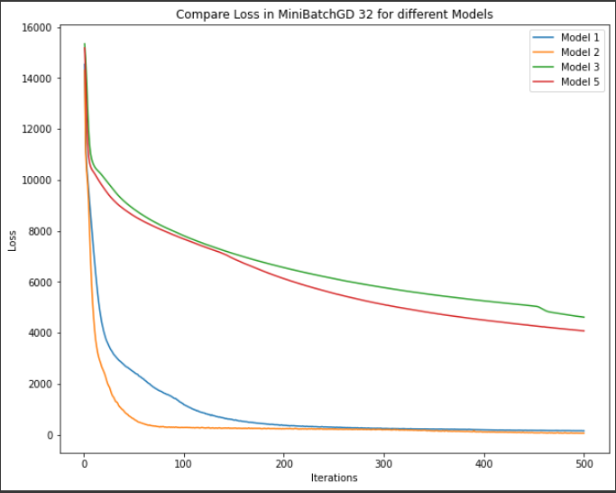
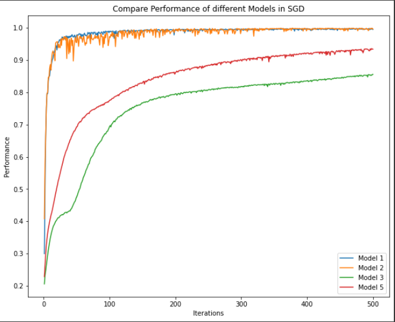
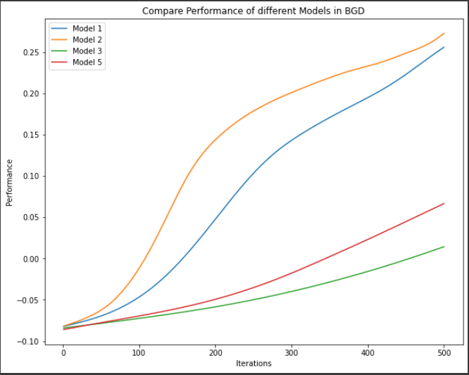
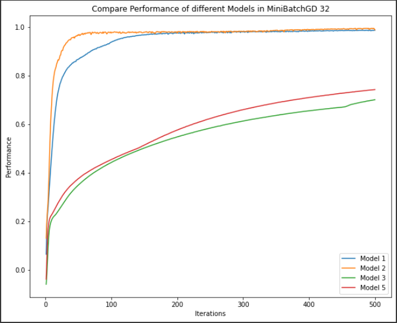

تعداد
نمونه های مورد استفاده برای تخمین خطای گرادیان، اندازه دسته نامیده میشود. سپس
از با استفاده از این تخمین می توان وزن مدل را آپدیت کرد.

ü     روش BGD : اگر اندازه دسته را اندازه کل نمونه های اموزشی در نظر بگیریم

ü     روش SGD: اگر اندازه دسته را 1 نمونه در نظر بگیریم

ü     روش minibatch gradient descent: اگر اندازه نمونه های دسته را
بیشتر از 1 و کمتر از تعداد کل نمونه ها فرض کنیم. در اینجا 32 را
انتخاب می کنم.

انتخاب
سایز کوچک برای نمونه های دسته مزایایی دارد من جمله:

تعداد کمتر اندازه دسته به
علت وجود نویز باعث اثر منظم سازی شده و خطای تعمیم کمتری خواهیم داشت.

فیت کردن مدل بر روی تعداد
کمتری از نمونه ها ساده تر است.

اندازه 32 نمونه اندازه
مناسبی است و نیازی به تنظیم ان نیست. ضمنا پایداری فرایند آموزش و عملکرد تعمیم
بهتری دارد.

توجه
کنید که تعداد نمونه های دسته تعیین کننده این است که مدل چقدر سریع یادگیری را
انجام خواهد داد و همچنین پایداری پروسه و روال آموزش مناسبی دارد.

4 مدل مختلف و هر مدل در دو وضعیت SGD و BGD ارزیابی
میشود. نمودار آبی رنگ معرف SGD ،قرمز رنگ معرف BGD و
سبز رنگ معرف MiniBatchGD 32 است. نمودارهای سمت راست R-Score و نمودارهای
سمت چپ Loss را نشان میدهند. مدل 1، 2، 3 و 5. تمام مدلها برای 500 تکرار
اموزش داده میشوند.

حالت
اول : شبکه دو لایه ای، در لایه اول 30 نود و در لایه دوم 20 نود. نمودار loss و
validation score

حالت
دوم : شبکه سه لایه ای، در لایه اول 30 نود، در لایه دوم 20 نود و در لایه آخر 10
نود دارد.نمودار loss و validation score

حالت
سوم : شبکه تک لایه ای، در لایه اول 30 نود دارد. نمودار loss و validation
score

حالت
5 : افزایش تعداد نودها در لایه اول به 60 نود. نمودار loss و validation
score

**توضیح
نمودارهای بالا:**

نمودار
آبی رنگ معرف SGD است. این نمودار در بخش R-Socre نویزی به نظر میرسد. مقدار این
نویز در نمودار سبز رنگ MiniBatch 32 بسیار کمتر و در نمودار BGD به کل حذف شده است. همانطور که
واضح است روش SGD دقت بهتری نسبت به روش MiniBatch و این روش نیز از روش BGD بهتر
است. علت حضور نوسانات کوچک در این نمودارها استفاده از نمونه های کم برای اموزش
مدل می باشد. اما هرچقدر تعداد نمونه ها بیشتر باشد روال آموزش کندتر شده و دیرتر
همگرا خواهد شد و این مطلبو نیست. نکته دیگر این است که اگر نمونه های بیشتری را
برای آموزش در نظر بگیریم ممکن است حافظه پر شود و به محدودیت برخوریم. در کل سرعت
و دقت روش SGD از بقیه روشها بهتر است.

مقایسه
نمودار loss مدلهای مختلف با سه روش SGD و BGD و MiniBatchGD
32 :

سرعت
کاهش loss مدلهای 1 و 2 قابل قبول است. اما مدلهای دیگر ممکن است اصلا به
دقت مطلبو نرسند و پیچیدگی لازم برای تخمین زدن تابع را نداشته باشند.

مقایسه
نمودار R-score مدلهای مختلف با سه روش SGD و BGD و
MiniBatchGD 32

سرعت
افزایش R-Score مدلهای 1 و 2 قابل قبول است.

توضیح  پارامترهای موجود در جدول زیر:

Mlp.score یا ضریب تعیین پیش بینی. این پارامتر هرچقدر به 1 نزدیک تر  باشد به این معنا است که مدل به خوبی توانسته
است داده های validation را تقریب بزند.

Mse: محاسبه میانگین خطای مربعات برای داده های اعتبارسنجی. هر چقدر
این عدد به 0 نزدیک تر باشد تقریب ما از تابع به خود تابع نزدیکتر است

mlp.loss_: آخرین loss محاسبه شده در مدل برای داده های اعتبارسنجی

mlp.best_loss_: کمترین loss محاسبه شده در مدل برای داده های اعتبارسنجی

جدول
زیر تاثیر استفاده از مدلهای پیچیده تر و ساده تر و همچنین تاثیر تعداد نمونه های Batch در افزایش و یا
کاهش دقت آموزش و تسریع آن مشاهده میشود.

| حالت         | Mlp.score | mse      | mlp.loss_ | mlp.best_loss_ | تعداد پارامترهای مدل | تعداد تکرار | تعداد نودها |
| ---------------- | --------- | -------- | --------- | -------------- | -------------------------------------- | --------------------- | --------------------- |
| اول           | 0.995     | 157.80   | 43.00     | 37.03          | 680                                    | 500                   | 30,20                 |
| اول-بچ      | 0.256     | 24149.56 | 10006.08  | 10006.08       | 680                                    | 500                   | 30,20                 |
| اول-بچ 32   | 0.986     | 447.18   | 156.29    | 156.29         | 680                                    | 500                   | 30,20                 |
| دوم           | 0.996     | 116.30   | 32.15     | 25.59          | 870                                    | 500                   | 30,20,10              |
| دوم-بچ      | 0.273     | 23603.2  | 9737.17   | 9737.17        | 870                                    | 500                   | 30,20,10              |
| دوم-بچ 32   | 0.988     | 379.06   | 60.63     | 60.18          | 870                                    | 500                   | 30,20,10              |
| سوم           | 0.856     | 4685.1   | 2353.19   | 2353.19        | 90                                     | 500                   | 30                    |
| سوم-بچ      | 0.01      | 31986.87 | 13761.04  | 13761.04       | 90                                     | 500                   | 30                    |
| سوم-بچ 32   | 0.70      | 9731.83  | 4613.4    | 4613.4         | 90                                     | 500                   | 30                    |
| پنجم         | 0.934     | 2147.98  | 1316.80   | 1316.80        | 180                                    | 500                   | 60                    |
| پنجم-بچ    | 0.067     | 30290.66 | 12868.94  | 12868.94       | 180                                    | 500                   | 60                    |
| پنجم-بچ 32 | 0.74      | 8372.68  | 4074.49   | 4074.49        | 180                                    | 500                   | 60                    |

نتیجه
گیری:

در
این تسک سعی بر آن شد تا تفاوت استفاده از SGD و BGD و MiniBatchGD
32 را در مدل کردن تابع بسنجیم. تاثیر استفاده از هر روش و هر مدل
شبکه به وضوح قابل رویت است. افزایش تعداد نمونه ها در Batch لزوما به معنای
آموزش بهتر و تسریع آموزش نیست. در اینجا دیدیم که SGD دقت و سرعت
بالاتری از MiniBatch  و Batch دارد. اما
استفاده از نمونه های کمتر منجر به نوسانی شدن نمودار Loss شد. توجه داشته
باشید که با گرفتن 32 نمونه برای Batch نویز در داده ها به اندازه کافی
لحاظ شده و خطای تعمیم –Generalization Error- کمتر خواهد بود.

پیچیده
ترین مدل ما مدل شماره 2 است که سه لایه دارد. این مدل سرعت همگرایی بالاتری از
بقیه دارد. اما در آموزش با تعداد تکرار بیشتر مدل 1 نیز به همان خوبی عمل می کند.
مدل 1 دارای 2 لایه بوده که نسبت به مدل 2 کمتر پیچیده است. پس با کاستن پیچیدگی
مدل و افزایش تکرارها می توان مدل را به خوبی آموزش داد.
